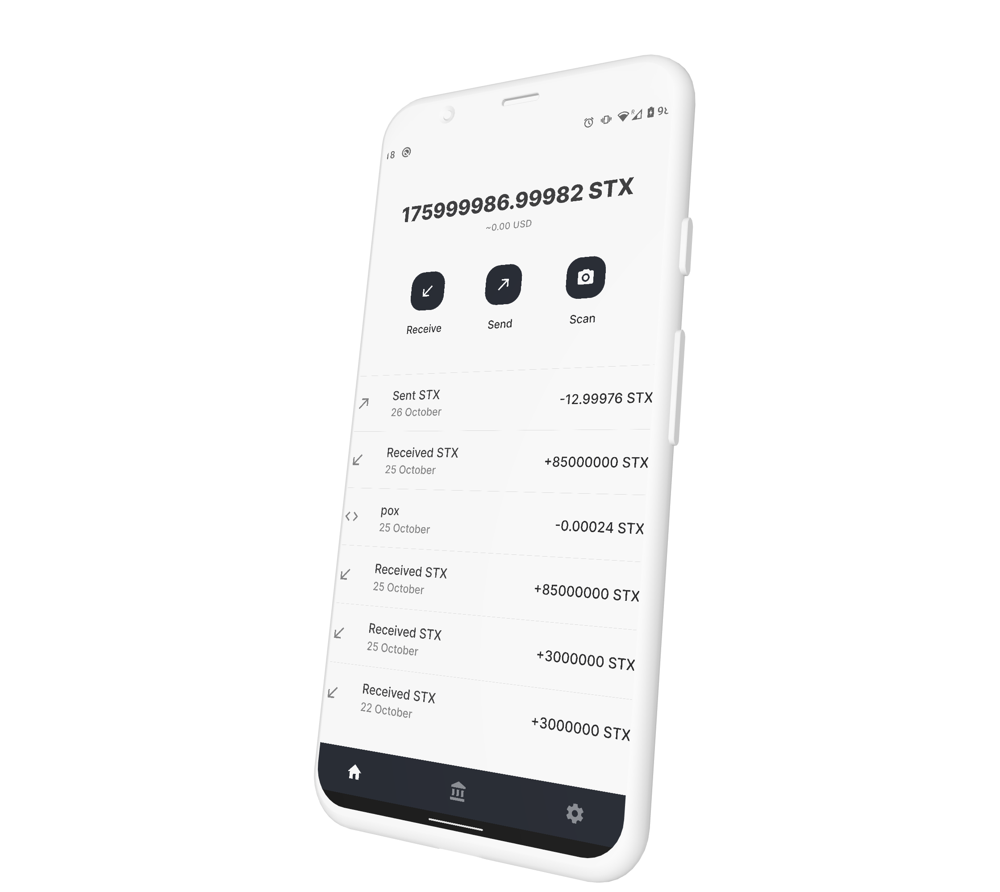

# blockstack-wallet

> 🚧 Beta - Only works on testnet 🚧

The open source mobile wallet that enables STX holders to send, receive and stack their tokens.

  

## Download

The app is in the process of being submitted to the stores. In the meantime you can download the application APK for android in the assets of the [releases](https://github.com/pradel/blockstack-wallet/releases).

## Features

- Send an receive Stacks
- List the transactions and display current balance
- Stacking dashboard
- Stake Stacks
- On testnet receive tokens from the faucet
- The private keys are stored securely
- Beautiful UI
- Light / dark mode

## Philosophy

The aim of the project is to enable people to use the Stacks blockchain easily and without a strong technical knowledge. All the interactions should be able to be done via an easy to use and nice looking interface without compromising on security.

## Security

- Your private keys are saved encrypted and never leave your phone. We use [expo SecureStore](https://docs.expo.io/versions/latest/sdk/securestore/) to save your private key encrypted in the secure enclave.
- Over the air updates are disabled, the app can only be updated through the store, or via the APK file. That way an attacker won't be able to inject malicious code via OTA.

## Built with

- react-native with expo bare workflow
- react-native-paper - UI design system
- react-navigation - Routing
- typescript
- blockstack SDK

## Contributing

Read our [contributing guide](CONTRIBUTING.md) to see how to locally setup the repository and see our development process.

## License

MIT © [Léo Pradel](https://www.leopradel.com/)
